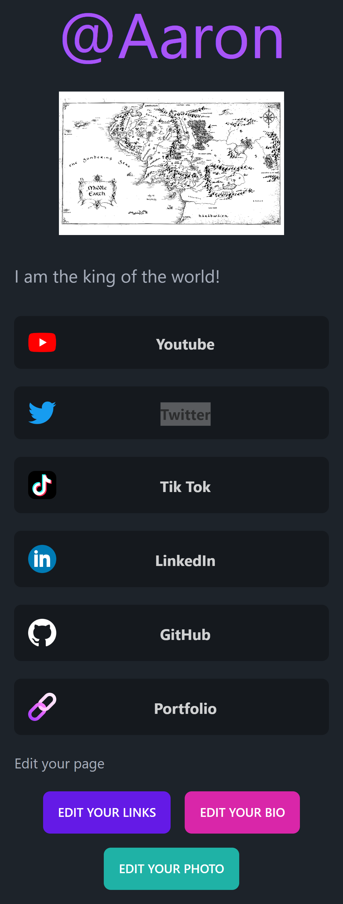
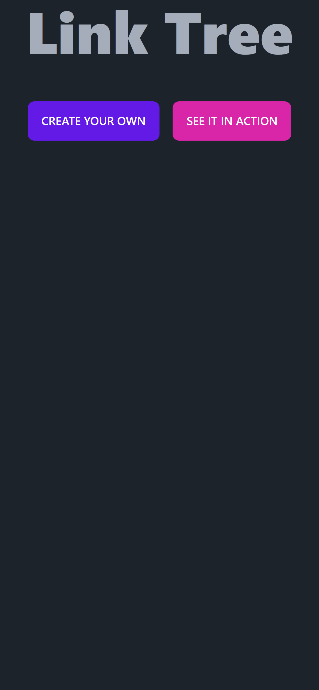
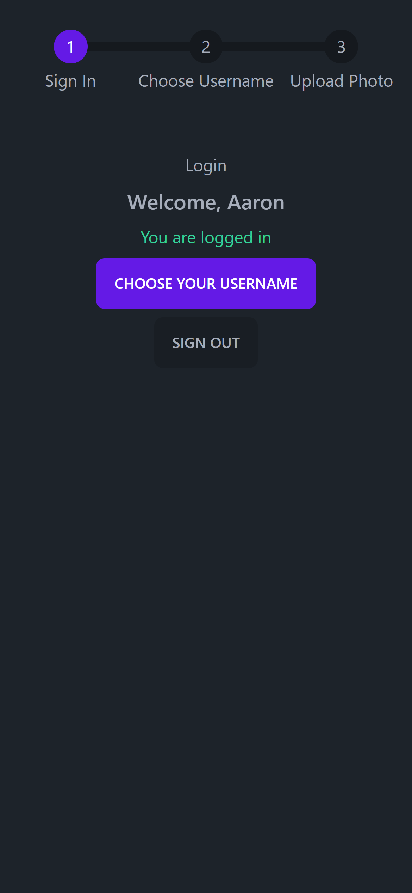
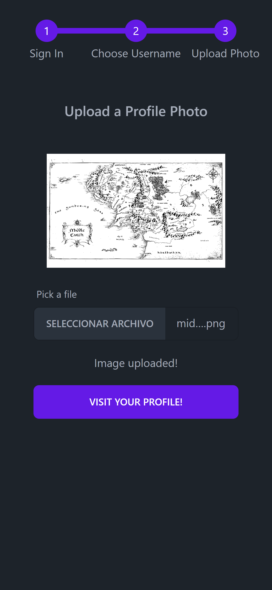
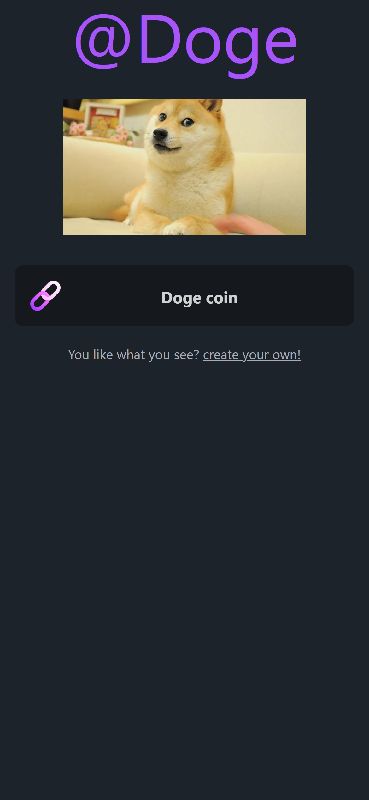
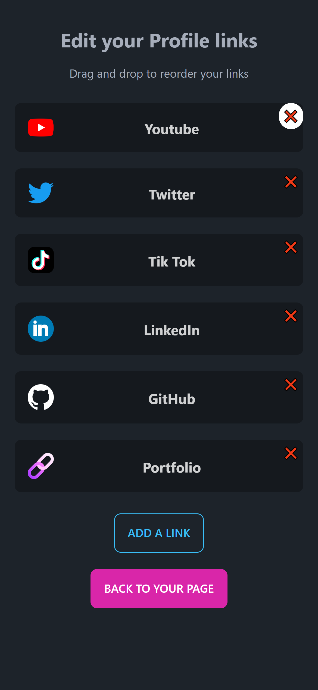

# Link Tree

<p align="center">
  
</p>

App made with Sveltekit, Firebase, TailwindCSS and Typescript. You can showcase your social media links and your projects.

## Developing

Once you've created a project and installed dependencies with `npm install` (or `pnpm install` or `yarn`), start a development server:

```bash
npm i
npm run dev

# or start the server and open the app in a new browser tab
npm run dev -- --open
```

## Building

To create a production version of your app:

```bash
npm run build
```

You can preview the production build with `npm run preview`.

### Images

<div>
  
  
  
  
  
</div>
